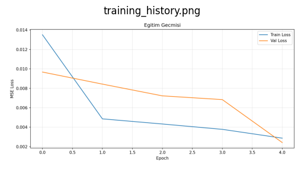
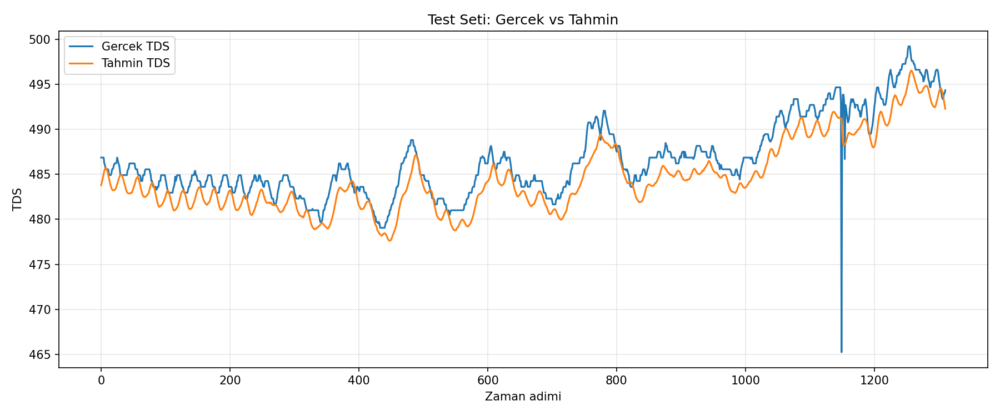

# LSTM TDS Tahmin Projesi

Sulama suyu tuzluluğu (TDS) tahmini için LSTM tabanlı kısa ve çalışır bir pipeline.

## Kurulum

```bash
python -m venv venv
source venv/bin/activate   # Windows: venv\Scripts\activate
pip install -r requirements.txt
```

## Kullanım

1) Veri üret / çek:

```bash
python data/generate_sample.py --site-id 09380000
```

2) Model eğit:

```bash
python src/train.py --epochs 50
```

Hızlı test:

```bash
python src/train.py --epochs 5
```

3) Tahmin al:

```bash
python src/predict.py --steps 24
```

## Varsayılan Ayarlar

- Pencere uzunluğu: `24`
- Bölme: `%70 train / %15 val / %15 test`
- Özellikler (4):
  - `specific_conductance`
  - `temperature`
  - `weather_index`
  - `soil_type_code`
- Model: `LSTM(50) -> LSTM(50) -> Dense(1)` (dropout: `0.2`)
- Loss: `MSE`, Optimizer: `Adam`

## Çıktılar

Eğitim sonrası `models/` klasörü:

- `tds_lstm_model.h5`
- `training_history.png`
- `predictions.png`
- `metrics.txt`
- `metadata.json`
- `scalers.pkl`
- `forecast.csv` (tahmin sonrası)

## Grafikler

GitHub/IDE içinde bu dosyaları açarak görebilirsin:

- `models/training_history.png`
- `models/predictions.png`

Örnek önizleme (dosya varsa görünür):




## Not

- Model her `train.py` çalıştırmada baştan eğitilir.
- Sürekli kullanımda akış: seyrek eğitim + sık tahmin.
- TDS yaklaşık dönüşüm: `TDS ≈ 0.65 * specific_conductance`
